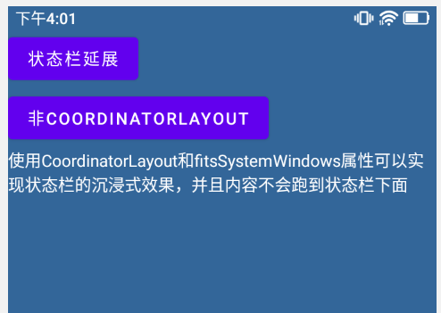

# TestStatusBarTransparent
实现状态栏沉浸式的两种方式

## 思路：
1. 状态栏背景设置为透明
2. 让元素可以延展至状态栏的位置
3. 布局中留出顶部状态栏的偏移量

## 方案：
### 一、CoordinatorLayout布局方案

使用**CoordinatorLayout**布局和*fitsSystemWindows*属性即可实现沉浸式

```kotlin
// Activity.kt
class MainActivity : AppCompatActivity() {
    override fun onCreate(savedInstanceState: Bundle?) {
        super.onCreate(savedInstanceState)
        setContentView(R.layout.activity_main)
        window.statusBarColor = Color.TRANSPARENT
    }
}
```

```xml
<!--activity_main.xml-->
<?xml version="1.0" encoding="utf-8"?>
<androidx.coordinatorlayout.widget.CoordinatorLayout xmlns:android="http://schemas.android.com/apk/res/android"
    xmlns:app="http://schemas.android.com/apk/res-auto"
    xmlns:tools="http://schemas.android.com/tools"
    android:layout_width="match_parent"
    android:layout_height="match_parent"
    android:background="#336699"
    android:fitsSystemWindows="true"
    tools:context=".MainActivity">

    <Button
        android:id="@+id/btn1"
        android:layout_width="wrap_content"
        android:layout_height="wrap_content"
        android:text="状态栏延展" />

    <Button
        android:id="@+id/btn2"
        android:layout_width="wrap_content"
        android:layout_height="wrap_content"
        android:layout_marginTop="50dp"
        android:text="非CoordinatorLayout" />

    <TextView
        android:layout_marginTop="100dp"
        android:layout_width="wrap_content"
        android:layout_height="wrap_content"
        android:text="使用CoordinatorLayout和fitsSystemWindows属性可以实现状态栏的沉浸式效果，并且内容不会跑到状态栏下面"
        android:textColor="@color/white"
        app:layout_constraintBottom_toBottomOf="parent"
        app:layout_constraintLeft_toLeftOf="parent"
        app:layout_constraintRight_toRightOf="parent"
        app:layout_constraintTop_toTopOf="parent" />
</androidx.coordinatorlayout.widget.CoordinatorLayout>
```



### 扩展：让指定元素延展至状态栏下方
	
使用**CollapsingToolbarLayout**包裹需要延展的元素配合**CoordinatorLayout**使用即可，并且给**CoordinatorLayout**、**CollapsingToolbarLayout**和**ImageView**都加上*fitsSystemWindows*属性

```xml
<!--activity_main2.xml-->
<?xml version="1.0" encoding="utf-8"?>
<androidx.coordinatorlayout.widget.CoordinatorLayout xmlns:android="http://schemas.android.com/apk/res/android"
    xmlns:app="http://schemas.android.com/apk/res-auto"
    xmlns:tools="http://schemas.android.com/tools"
    android:layout_width="match_parent"
    android:layout_height="match_parent"
    android:background="#336699"
    android:fitsSystemWindows="true"
    tools:context=".MainActivity">

    <com.google.android.material.appbar.CollapsingToolbarLayout
        android:layout_width="match_parent"
        android:layout_height="match_parent"
        android:fitsSystemWindows="true">

        <ImageView
            android:layout_width="match_parent"
            android:layout_height="match_parent"
            android:fitsSystemWindows="true"
            android:scaleType="centerCrop"
            android:src="@mipmap/bg" />
    </com.google.android.material.appbar.CollapsingToolbarLayout>

    <Button
        android:layout_width="wrap_content"
        android:layout_height="wrap_content"
        android:onClick="back"
        android:text="返回" />

    <TextView
        android:layout_width="wrap_content"
        android:layout_height="wrap_content"
        android:layout_marginTop="50dp"
        android:text="如果想要某些元素延展到状态栏下面，则需要再使用CollapsingToolbarLayout包裹需要延展的元素配合CoordinatorLayout使用即可"
        android:textColor="@color/white"
        app:layout_constraintBottom_toBottomOf="parent"
        app:layout_constraintLeft_toLeftOf="parent"
        app:layout_constraintRight_toRightOf="parent"
        app:layout_constraintTop_toTopOf="parent" />
</androidx.coordinatorlayout.widget.CoordinatorLayout>
```


### 二、非CoordinatorLayout布局方案

不使用**CoordinatorLayout**就需要参考**CoordinatorLayout**的实现方式：
调用`setSystemUiVisibility()`来实现沉浸式和调用`setOnApplyWindowInsetsListener()`来设置顶部偏移

```kotlin
// ActivityMain3.kt
class MainActivity3 : AppCompatActivity() {
    override fun onCreate(savedInstanceState: Bundle?) {
        super.onCreate(savedInstanceState)
        setContentView(R.layout.activity_main3)

        window.statusBarColor = Color.TRANSPARENT

        val frameLayout = findViewById<ViewGroup>(android.R.id.content).getChildAt(0)

        // 给根布局(FrameLayout)添加padding
        ViewCompat.setOnApplyWindowInsetsListener(frameLayout
        ) { v, insets ->
            // v代表根布局,内部整体下移
            v.setPadding(
                v.paddingLeft,
        // 通过systemWindowInsetTop来获取状态栏高度
                insets.systemWindowInsetTop,
                v.paddingRight,
                v.paddingBottom)
            // 同时可以在这里对其他元素的边距进行调整
            insets
        }

        // 沉浸式：可以延展到状态栏以下
        frameLayout.systemUiVisibility = SYSTEM_UI_FLAG_LAYOUT_STABLE or SYSTEM_UI_FLAG_LAYOUT_FULLSCREEN

    }

    fun back(view: View) {
        finish()
    }
}
```

```xml
<!--activity_main3.xml-->
<?xml version="1.0" encoding="utf-8"?>
<FrameLayout xmlns:android="http://schemas.android.com/apk/res/android"
    xmlns:app="http://schemas.android.com/apk/res-auto"
    xmlns:tools="http://schemas.android.com/tools"
    android:layout_width="match_parent"
    android:layout_height="match_parent"
    android:background="#336699"
    android:paddingTop="20dp"
    tools:context=".MainActivity3">

    <Button
        android:id="@+id/btn_back"
        android:layout_width="wrap_content"
        android:layout_height="wrap_content"
        android:onClick="back"
        android:text="返回" />

    <TextView
        android:layout_width="wrap_content"
        android:layout_height="wrap_content"
        android:layout_marginTop="50dp"
        android:text="使用ViewCompat.setOnApplyWindowInsetsListener()和view.setSystemUiVisibility()来动态设置沉浸式"
        android:textColor="@color/white"
        app:layout_constraintBottom_toBottomOf="parent"
        app:layout_constraintLeft_toLeftOf="parent"
        app:layout_constraintRight_toRightOf="parent"
        app:layout_constraintTop_toTopOf="parent" />
</FrameLayout>
```


> 参考：https://mp.weixin.qq.com/s/AiCNJAi9CgYDE1UuzCboGg
